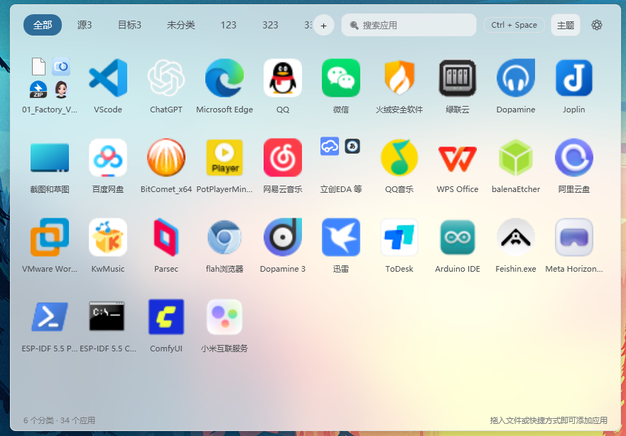
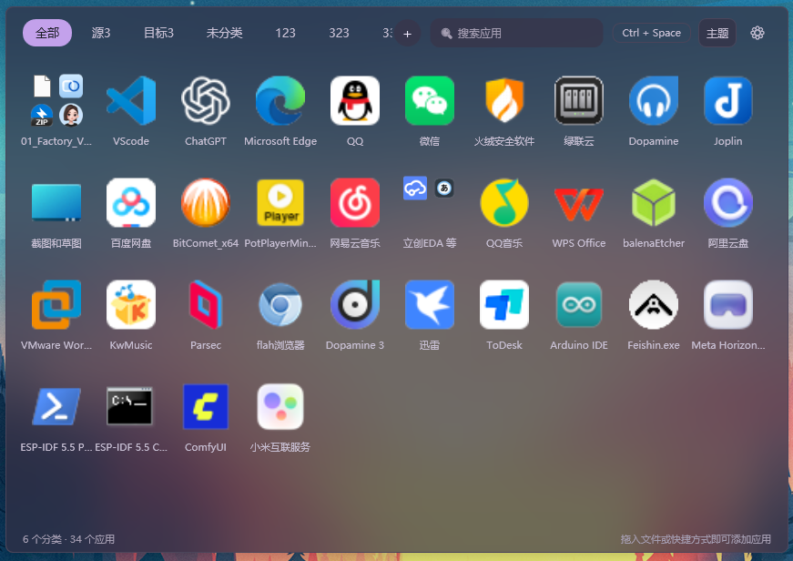
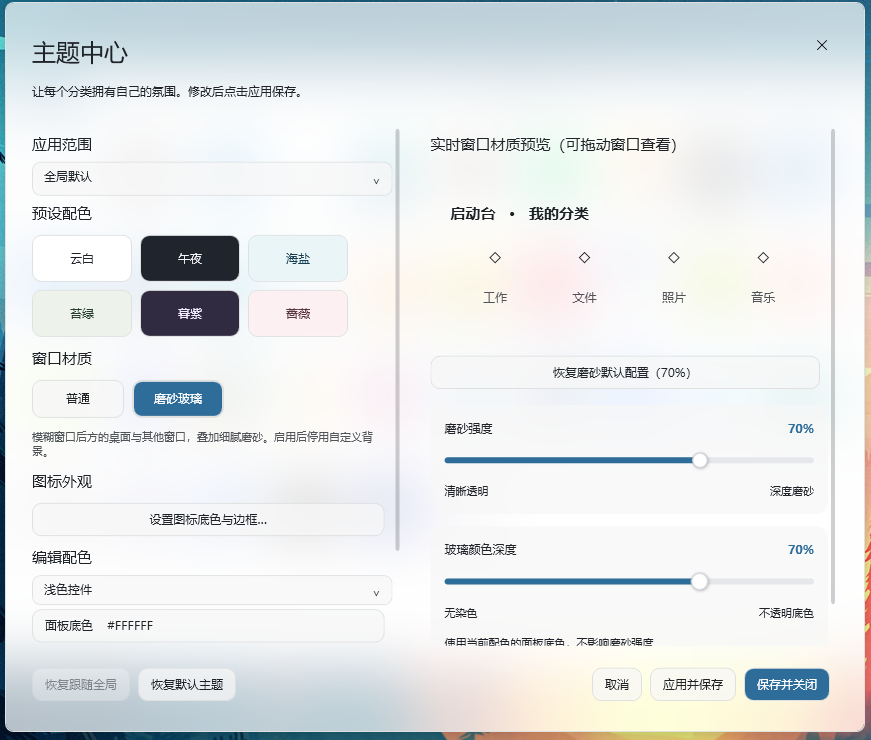
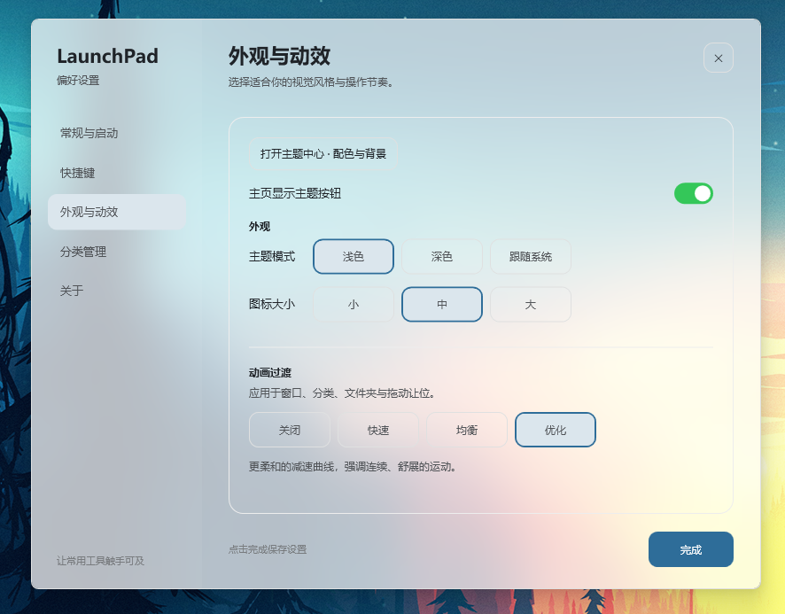

# LaunchPad v0.98

[中文](README.md) · **English**

A lightweight Windows application launcher with keyboard shortcuts, categories, folders, continuous drag and drop, customizable themes, and animated backgrounds.

## Preview

| Home (light frosted) | Home (dark frosted) |
| --- | --- |
|  |  |

| Theme Center | Settings |
| --- | --- |
|  |  |

## v0.98 changes

- Experimental plugin API v1 with installation, search, context menus and independent settings.
- Folders dissolve automatically when one item remains, preserving its position.
- Faster sign-in startup through an immediate logon task with a fallback, plus deferred settings-window creation.
- Distinct plugin, theme and backup file badges; double-click a plugin file to import it.

## Download and run

The current source is v0.98. The links below remain on the published v0.97.1 packages until v0.98 assets are released.

Download from [GitHub Releases](https://github.com/lokey-t/launchPad/releases/tag/v0.97.1) or [Gitee Releases](https://gitee.com/lokey-t/launchPad/releases/tag/v0.97.1):

| Package | Requirements |
| --- | --- |
| `LaunchPad-v0.97.1-win-x64-setup.exe` | Recommended. Offline single EXE setup with runtime included, folder selection and in-place upgrades preserving settings and backups. |
| `LaunchPad-v0.97.1-win-x64.zip` | Portable full package. Includes the .NET runtime. Extract and run `LaunchPad.exe`. |
| `LaunchPad-v0.97.1-win-x64-framework-dependent.zip` | Smaller package requiring .NET 8 Desktop Runtime (x64). Keep all extracted files together. |

Supports Windows 10 / 11 x64. Setup detects existing installations; select the original folder for an unregistered portable copy that is not running. Exit the previous tray instance before upgrading with ZIP files. The default show/hide shortcut is **Ctrl + Space**, configurable in Settings. Closing the main window leaves the app in the tray; use the tray menu to exit completely.

## Features

The NSIS offline installer is approximately 45 MB, about 65% smaller than v0.97, and is available on both GitHub and Gitee.

- **Apps and folders:** add files or shortcuts by dropping them into the launcher. Search, choose single- or double-click launching, and customize display names and icons. Duplicate imports show a Toast with the existing entry and category.
- **Continuous drag and drop:** animated reordering in the main grid and folders. Drop directly onto a folder to move inside, or hover to open it and choose a position. Dragging out closes the folder and continues the same drag. Press Esc to cancel an internal drag.
- **Categories:** drag or wheel-scroll the category strip, including edge scrolling while dragging files. Reorder categories in Settings. Change an entry's category from its context menu.
- **Hover timing:** independently configure folder opening and category switching from 0.3 to 5 seconds, with gentle magnetic stops at 0.5, 1, and 2 seconds. Hovering never changes ownership before a drop.
- **Shortcuts:** manage global and category shortcuts together. Category shortcuts are set, edited, or cleared via a dialog; the shortcut is temporarily disabled while capturing and takes effect immediately on confirm. Optionally allow category shortcuts to close the window.
- **Icon appearance:** configure background opacity and choose between no border, shadow border, and solid border. Shadow direction is adjusted visually by dragging a sun control, with a strength slider and live preview. Reset to defaults with one click.
- **Motion and layout:** Off, Fast, Balanced, and Optimized modes; continuous folder transitions, slim rounded scrollbars, and smooth wheel scrolling. Configure icon size, window position (including "last position"), and automatic hiding.
- **Layout refinements:** overlay scrollbars no longer reduce content width; Small / Medium / Large icon modes use tighter spacing so each row holds more icons; a soft shadow appears above the bottom bar when content is scrollable.
- **Other:** launch at startup, tray menu, opening the existing main window when launched again, and click-outside dismissal for the New Category dialog. Tab navigation and Alt access-key hints are suppressed within the app without changing Windows settings.

## Updated in v0.97.1

- Bundled incremental updates: changed and added files share one ZIP, reducing release attachments, with full-package fallback.
- Smaller NSIS installer retaining offline installation, folder selection and in-place upgrades.

## Existing features

- Startup update notifications and manual checks in About: Ignore, Later, downloads from either host, per-file incremental updates and rollback on failure.
- First-run onboarding, accessible again from About; shortcut target resolution enabled by default and configurable in General.
- New icon, consistent tray menu, themed drag previews, and home sorting by added time, name or last-opened time.
- Chinese/English switching in General. Save, delete, import and export `.qdtstylebackup` presets with their media without replacing other data; unknown newer settings are retained for future versions.
- Factory reset retains backup points. Upgrades keep apps, categories, themes and imported assets.

## Theme Center

Open from the main window or Settings → Appearance & Motion. The main-window theme button can be hidden.

1. Choose the global default or a specific category. Categories with custom overrides are flagged in the dropdown.
2. Pick Cloud, Midnight, Sea Salt, Moss, Dusk, or Rose, or edit surface, text, and accent colors.
3. Upload a background and adjust its overlay. Supported formats include PNG / JPG / BMP, GIF, and MP4 / WMV / AVI / MOV / M4V video. Video playback depends on Windows decoding support.
4. Apply and save. Category colors and backgrounds independently override or inherit global settings. "Reset to default theme" in the lower-left restores all theme settings, including per-category overrides.

Window Material is independent of the palette: Normal or Frosted Glass, with separate per-category inheritance. Frosted Glass uses the Windows compositor to blur live desktop and window content behind the launcher while keeping text and icons sharp; frosted strength and glass tint depth are adjustable. Background upload, background override, and overlay controls are disabled while frosted glass is active; existing media is retained and restored in Normal mode. Move the Theme Center window to see the live material preview. Effects depend on Windows composition and transparency support.

Colors and backgrounds transition smoothly between categories. Videos loop silently; changing colors or the overlay for the same video preserves playback. GIF and video playback pause while hidden. Invalid media produces a message and falls back to the theme surface.

## Configuration and data

- Settings live in `%AppData%/LaunchPad/config.json`; upgrading does not require copying the old application directory.
- Uploaded icons and backgrounds are copied to `%AppData%/LaunchPad/Icons` and `Backgrounds`, so moving the original file does not break them.
- Renaming changes the display name only. Removing entries or categories does not delete disk files.
- Click Done in Settings to save. Category reordering updates the main window when the drag is released.

## Build from source

Requires Windows and the .NET 8 SDK. No third-party NuGet dependencies.

```powershell
dotnet build LaunchPad.csproj -c Release
dotnet publish LaunchPad.csproj -c Release -r win-x64 --self-contained true -p:PublishSingleFile=true -p:IncludeNativeLibrariesForSelfExtract=true -o bin/publish
```

Exit any instance using the output directory before rebuilding, or choose a different directory.

| Source | Purpose |
| --- | --- |
| `MainWindow.*` | Launcher, drag sessions, folder transitions, category scrolling, and themes |
| `SettingsWindow.*` | Settings, category sorting, shortcuts, and magnetic sliders |
| `ThemeCenterWindow.cs` / `Controls` | Theme editing and background media |
| `Models` / `Services` | Configuration, hotkeys, entry moves, icons, themes, and motion |
| `Themes` / `Converters` | WPF styles, resources, and binding converters |

See [release notes](RELEASE_NOTES.md). A SHA-256 checksum file accompanies the release.

Build release assets with [Build-Release.ps1](tools/Build-Release.ps1). See [installer details](docs/INSTALLER.md) and the reusable [launchpad-release skill](docs/skills/launchpad-release/SKILL.md).

## Experimental plugin extensions

The current source adds plugin API v1 (not included in the v0.97.1 release): on-demand child processes, search, file context menus, home quick actions and plugin settings. See [plugin development](docs/PLUGINS.md), `PluginSdk/` and the two complete `PluginExamples/`. Native plugins run with the current user’s access; process separation is not a security sandbox.
